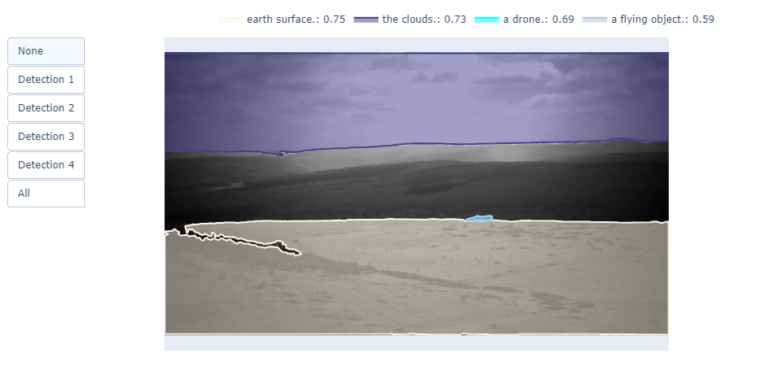

# Munich Defense Systems Hack 2025 Submission
# ThermoGen: Generation of thermal images from RGB, greyscale or pure noise.
Team project at Munich Defense Systems Hackaton 2025. We aim to generate thermal images to enlargen scarce existing datasets. We leverage the semantic information about the objects and high accuracy of object masking obtained with GroundedSAM model. Thermal images are generated from pure noise or using the segmentation information and coarse simple text prompts or rgb data

  

**Top:** Thermal image generated with an RGB or greyscale image as input using UNet.  
**Bottom:** Thermal image generated with an RGB or greyscale image as input using UNet and postprocessed with GroundedSAM segmentation masks for the target object. We can generate better termal information for the target objects using coarse or fine results of the state-of-the-art segmentation.

*The segmentation masks visualized over the target footage created by GroundedSAM. A State-of-the-Art segmentation model allows to obtain rich semantic information on low resolution images.*

**What is this?**
A repository of methods for thermal images generation and experimental code. You are advised to run .ipynb notebooks in Google Colab, preprocess your existing image data (you can use open-source CIDIS dataset https://github.com/vision-cidis/CIDIS-dataset/tree/main), train a generative model, improve the result with state-of-the-art segmentation model (GroundedSAM) and infer new thermal images.

**Dataset structure**
We aim to have two folders - one with RGB or greyscale data and other one with thermal images. Adapt the parameter of n_channels where applicable in the scripts and notebooks.

**Repo structure**
- data # scripts to preprocess videos to create custom datasets - match frames and resize.
- experimental # some messy notebooks where we tested other models for Image Generation (Pix2PixHD, CUT).
- helpers # where we have our postprocessing to combine segmentation masks with predictions.
- stable_diffusion # a finetuning pipeline for image generation using segmentation data or other metadata / data domains or no input data at all (from pure noise).
- unet # main model training and inference (UNet).

**Experiments**:
- Pix2PixHD
- CUT
- StableDiffusion + ControlNet
- GroundedSAM

